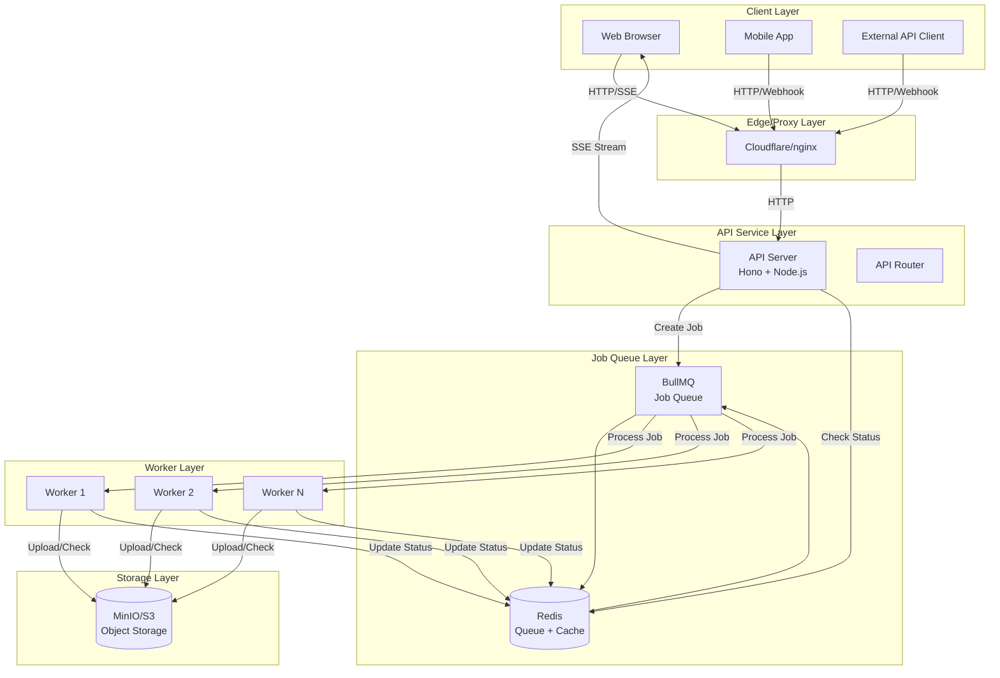
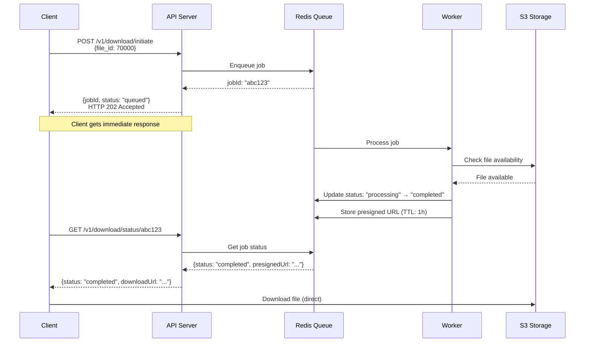
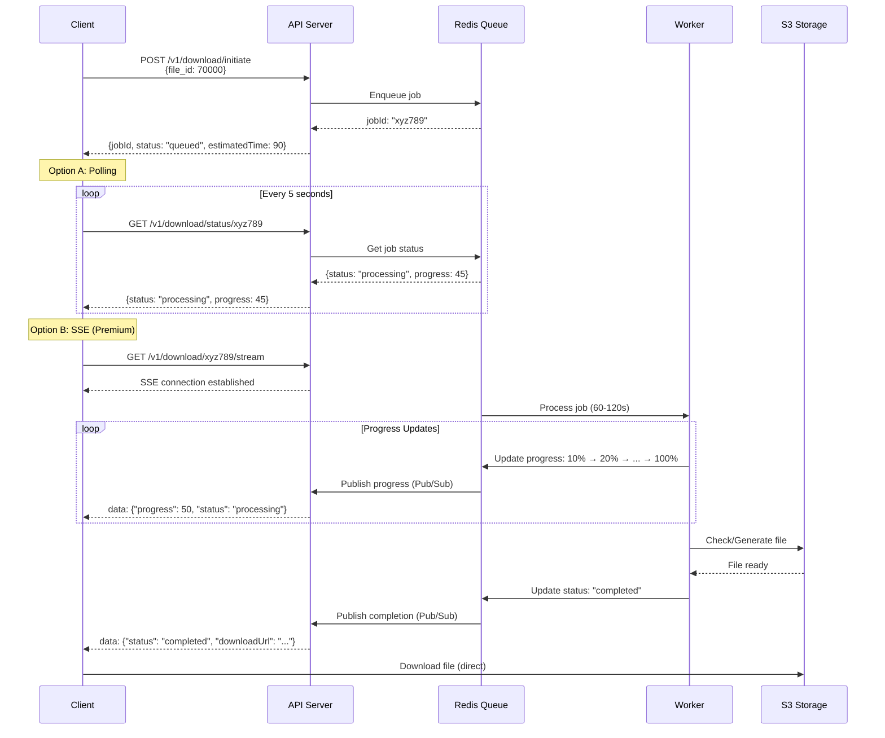

# Architecture Design: Long-Running Download System

## Executive Summary

This document presents a **Hybrid Architecture** solution for handling variable-duration file downloads (10-120 seconds) in a microservice environment. The solution addresses connection timeouts, poor user experience, resource exhaustion, and retry storms through asynchronous job processing, multiple client notification patterns, and robust error handling.

---

## Table of Contents

1. [Problem Statement](#1-problem-statement)
2. [Architecture Diagram](#2-architecture-diagram)
3. [Technical Approach](#3-technical-approach)
4. [Implementation Details](#4-implementation-details)
5. [Proxy Configuration](#5-proxy-configuration)
6. [Frontend Integration](#6-frontend-integration)
7. [Edge Cases & Error Handling](#7-edge-cases--error-handling)
8. [Scaling & Performance](#8-scaling--performance)

---

## 1. Problem Statement

### Current Issues

The microservice handles file downloads with variable processing times:
- **Fast downloads**: Complete within ~10 seconds
- **Slow downloads**: Can take up to 120+ seconds

When deployed behind reverse proxies (Cloudflare, nginx, AWS ALB), critical issues arise:

1. **Connection Timeouts**: Proxies like Cloudflare default to 100s timeout, terminating long-running HTTP connections
2. **User Experience**: Users wait 2+ minutes with no feedback, leading to frustration
3. **Resource Exhaustion**: Holding HTTP connections open for extended periods consumes server memory
4. **Retry Storms**: Dropped connections trigger automatic retries, creating duplicate work

### Current Flow (Problematic)

```
Client → POST /v1/download/start → [Wait 60-120s] → Response
         ❌ Times out at 30s (REQUEST_TIMEOUT_MS)
         ❌ Proxy times out at 100s (Cloudflare)
         ❌ User sees 504 Gateway Timeout
```

---

## 2. Architecture Diagram

### 2.1 System Overview



### 2.2 Data Flow: Fast Download (< 15s)



### 2.3 Data Flow: Slow Download (60-120s)



---

## 3. Technical Approach

### 3.1 Chosen Approach: Hybrid Pattern (Option D)

We chose a **Hybrid Approach** combining:
- **Polling Pattern** (default, simple, universal support)
- **Server-Sent Events (SSE)** (real-time updates for premium users)
- **Webhook Pattern** (backend-to-backend integrations)

### 3.2 Justification

#### Why Hybrid Over Single Pattern?

**Polling Alone** ❌
- Simple but inefficient (constant HTTP requests)
- Not real-time (user sees updates only on poll interval)
- Wastes bandwidth and server resources

**SSE Alone** ❌
- Real-time but requires persistent connections
- Not all clients support SSE
- Complex to implement for all use cases

**Webhooks Alone** ❌
- Perfect for backend integrations
- Requires public endpoint (problematic for browsers)
- No real-time feedback for web users

**Hybrid Approach** ✅
- **Flexibility**: Right tool for right use case
- **Compatibility**: Works everywhere (polling as fallback)
- **User Experience**: Real-time for web users (SSE), efficient for mobile (polling)
- **Integration**: Webhooks for backend systems
- **Production-Ready**: Used by major platforms (GitHub, AWS, Stripe)

### 3.3 Technology Stack

- **Job Queue**: Redis + BullMQ
  - Fast, in-memory queue
  - Built-in retry logic
  - Job prioritization
  - Progress tracking

- **Cache/Storage**: Redis
  - Job status storage
  - Pub/Sub for real-time updates
  - TTL-based expiration

- **Object Storage**: MinIO/S3
  - File storage
  - Presigned URLs for direct downloads

- **API Framework**: Hono (existing)
  - Fast HTTP framework
  - SSE support
  - Type-safe routes

---

## 4. Implementation Details

### 4.1 API Contract Changes

#### Existing Endpoints (Modified)

**POST /v1/download/initiate** (Enhanced)
```typescript
// Request
{
  file_ids: number[]  // Existing
  callbackUrl?: string  // New: For webhook pattern
}

// Response
{
  jobId: string
  status: "queued" | "processing"
  totalFileIds: number
  estimatedTime?: number  // New: Estimated completion time in seconds
  message?: string
}
```

#### New Endpoints

**GET /v1/download/status/:jobId**
```typescript
// Response
{
  jobId: string
  status: "queued" | "processing" | "completed" | "failed"
  progress: number  // 0-100
  fileId?: number
  downloadUrl?: string  // Presigned S3 URL
  error?: string
  createdAt: string  // ISO 8601
  completedAt?: string  // ISO 8601
  estimatedCompletion?: string  // ISO 8601
}
```

**GET /v1/download/:jobId/stream** (SSE)
```
Content-Type: text/event-stream

data: {"progress": 25, "status": "processing"}

data: {"progress": 50, "status": "processing"}

data: {"progress": 100, "status": "completed", "downloadUrl": "https://..."}
```

**GET /v1/download/:jobId** (Download result)
```typescript
// If completed, returns presigned URL or redirects
// If not ready, returns status
{
  status: "queued" | "processing"
  progress: number
  // OR redirects to presigned URL if completed
}
```

**DELETE /v1/download/:jobId** (Cancel job)
```typescript
// Response
{
  jobId: string
  status: "cancelled"
  message: "Job cancelled successfully"
}
```

### 4.2 Database/Cache Schema

#### Redis Data Structures

**Job Status (Hash)**
```
Key: job:status:{jobId}
Fields:
  - jobId: string (UUID)
  - fileId: number
  - userId?: string
  - status: "queued" | "processing" | "completed" | "failed" | "cancelled"
  - progress: number (0-100)
  - s3Key?: string
  - presignedUrl?: string
  - error?: string
  - createdAt: string (ISO 8601)
  - completedAt?: string (ISO 8601)
  - estimatedCompletion?: string (ISO 8601)
  - callbackUrl?: string (for webhooks)
TTL: 24 hours (after completion)
```

**Job Queue (BullMQ)**
```
Queue: download-jobs
Job Data:
  - jobId: string
  - fileId: number
  - userId?: string
  - callbackUrl?: string
Job Options:
  - attempts: 3
  - backoff: { type: "exponential", delay: 5000 }
  - removeOnComplete: true
  - removeOnFail: false (for debugging)
```

**User Job List (Set)**
```
Key: user:jobs:{userId}
Members: [jobId1, jobId2, ...]
TTL: 7 days
```

**Rate Limiting (Counter)**
```
Key: rate:limit:user:{userId}:window:{windowStart}
Value: number of jobs created in window
TTL: 60 seconds (window size)
```

### 4.3 Background Job Processing Strategy

#### Worker Process Architecture

```typescript
// Worker Service (separate process or same container with PM2)
import { Worker, Job } from 'bullmq';
import { Queue } from 'bullmq';
import { RedisConnection } from './redis';

const downloadQueue = new Queue('download-jobs', {
  connection: RedisConnection
});

const worker = new Worker('download-jobs', async (job: Job) => {
  const { jobId, fileId, callbackUrl } = job.data;
  
  try {
    // Update status to processing
    await updateJobStatus(jobId, {
      status: 'processing',
      progress: 0
    });
    
    // Simulate processing (or actual file generation)
    const estimatedTime = getEstimatedTime(fileId);
    const chunks = 10; // Progress updates
    
    for (let i = 1; i <= chunks; i++) {
      // Simulate work
      await sleep(estimatedTime / chunks);
      
      // Update progress
      await updateJobStatus(jobId, {
        progress: (i / chunks) * 100
      });
      
      // Publish progress via Redis Pub/Sub for SSE
      await redis.publish(`job:${jobId}`, JSON.stringify({
        progress: (i / chunks) * 100,
        status: 'processing'
      }));
    }
    
    // Check/generate file in S3
    const s3Result = await checkS3Availability(fileId);
    
    if (s3Result.available) {
      // Generate presigned URL (1 hour TTL)
      const presignedUrl = await generatePresignedUrl(s3Result.s3Key, 3600);
      
      // Update status to completed
      await updateJobStatus(jobId, {
        status: 'completed',
        progress: 100,
        downloadUrl: presignedUrl,
        completedAt: new Date().toISOString()
      });
      
      // Trigger webhook if provided
      if (callbackUrl) {
        await triggerWebhook(callbackUrl, {
          jobId,
          status: 'completed',
          downloadUrl: presignedUrl
        });
      }
      
      // Publish completion
      await redis.publish(`job:${jobId}`, JSON.stringify({
        status: 'completed',
        downloadUrl: presignedUrl
      }));
      
    } else {
      throw new Error('File not available in S3');
    }
    
  } catch (error) {
    // Update status to failed
    await updateJobStatus(jobId, {
      status: 'failed',
      error: error.message
    });
    
    // Trigger webhook if provided
    if (callbackUrl) {
      await triggerWebhook(callbackUrl, {
        jobId,
        status: 'failed',
        error: error.message
      });
    }
    
    throw error; // BullMQ will retry
  }
}, {
  connection: RedisConnection,
  concurrency: 5, // Process 5 jobs concurrently
  limiter: {
    max: 10,
    duration: 1000 // Max 10 jobs per second
  }
});
```

#### Worker Scaling

- **Horizontal Scaling**: Run multiple worker instances
- **Concurrency**: Each worker processes N jobs concurrently
- **Priority Queues**: High-priority jobs processed first
- **Worker Health**: Monitor worker process health

### 4.4 Error Handling & Retry Logic

#### Retry Strategy

```typescript
// BullMQ Job Options
{
  attempts: 3,  // Max 3 attempts
  backoff: {
    type: 'exponential',
    delay: 5000  // 5s, 10s, 20s delays
  },
  removeOnFail: false  // Keep failed jobs for debugging
}
```

#### Error Categories

1. **Transient Errors** (retry)
   - Network timeouts
   - S3 temporary unavailability
   - Redis connection issues

2. **Permanent Errors** (fail immediately)
   - Invalid file ID
   - Authentication failures
   - File not found (after verification)

3. **User Cancellation**
   - User explicitly cancels job
   - No retry

#### Error Response Format

```typescript
{
  jobId: string
  status: "failed"
  error: string
  errorCode?: string  // "FILE_NOT_FOUND", "TIMEOUT", etc.
  retryable: boolean
  retriesRemaining: number
}
```

### 4.5 Timeout Configuration

| Layer | Timeout | Configuration |
|-------|---------|---------------|
| **Client** | 30s (initial request) | `REQUEST_TIMEOUT_MS` |
| **Reverse Proxy** | 600s (SSE connections) | `proxy_read_timeout` |
| **API Server** | 30s (HTTP), 600s (SSE) | Hono timeout middleware |
| **Worker Process** | 300s (per job) | BullMQ job timeout |
| **Redis** | 5s (connection) | Redis client config |
| **S3** | 60s (per operation) | AWS SDK config |
| **Presigned URL** | 3600s (1 hour) | S3 URL expiration |

---

## 5. Proxy Configuration

### 5.1 Cloudflare Configuration

#### Timeout Settings

**Page Rules** (if using Cloudflare):
```
URL Pattern: *api.example.com/v1/download/*
Settings:
  - Cache Level: Bypass
  - Disable Performance
```

**Workers/Transform Rules** (Recommended):
```javascript
// Increase timeout for SSE endpoints
if (request.url.includes('/v1/download/') && 
    request.url.includes('/stream')) {
  // Allow long-running connections
  // Cloudflare default: 100s, increase via Workers
}
```

#### WebSocket/SSE Support

- Cloudflare supports SSE by default
- No special configuration needed for SSE
- WebSocket support requires Workers (for future WebSocket upgrades)

#### Best Practices

1. **Cache Control**: Disable caching for job status endpoints
2. **Rate Limiting**: Configure rate limits at Cloudflare level
3. **Always Online**: Disable for API endpoints (only for static assets)

### 5.2 Nginx Configuration

#### Complete Nginx Config

```nginx
upstream api_backend {
    server api-service:3000;
    keepalive 32;
}

server {
    listen 80;
    server_name api.example.com;

    # General proxy settings
    proxy_http_version 1.1;
    proxy_set_header Host $host;
    proxy_set_header X-Real-IP $remote_addr;
    proxy_set_header X-Forwarded-For $proxy_add_x_forwarded_for;
    proxy_set_header X-Forwarded-Proto $scheme;
    proxy_set_header Connection "";

    # Increase timeouts for long-running requests
    proxy_connect_timeout 60s;
    proxy_send_timeout 600s;
    proxy_read_timeout 600s;
    send_timeout 600s;

    # Don't buffer responses (important for SSE)
    proxy_buffering off;
    proxy_cache off;

    # Regular API endpoints
    location /v1/ {
        proxy_pass http://api_backend;
        proxy_set_header Connection "";
    }

    # SSE endpoint - special configuration
    location ~ ^/v1/download/[^/]+/stream$ {
        proxy_pass http://api_backend;
        proxy_http_version 1.1;
        proxy_set_header Connection '';
        proxy_buffering off;
        proxy_cache off;
        proxy_read_timeout 600s;
        
        # Important for SSE
        chunked_transfer_encoding on;
        proxy_set_header X-Accel-Buffering no;
    }

    # Job status endpoints - no caching
    location ~ ^/v1/download/[^/]+/status$ {
        proxy_pass http://api_backend;
        add_header Cache-Control "no-cache, no-store, must-revalidate";
        add_header Pragma "no-cache";
        add_header Expires "0";
    }

    # Health check - fast timeout
    location /health {
        proxy_pass http://api_backend;
        proxy_read_timeout 5s;
    }
}
```

#### Key Settings Explained

- **`proxy_read_timeout 600s`**: Allow 10-minute connections for SSE
- **`proxy_buffering off`**: Don't buffer SSE streams
- **`chunked_transfer_encoding on`**: Required for SSE
- **`X-Accel-Buffering no`**: Disable Nginx buffering

### 5.3 AWS Application Load Balancer (ALB)

#### Target Group Configuration

```yaml
Target Group Settings:
  - Health Check Path: /health
  - Health Check Interval: 30s
  - Health Check Timeout: 5s
  - Healthy Threshold: 2
  - Unhealthy Threshold: 3
  
  - Deregistration Delay: 30s
  - Connection Draining: Enabled
```

#### Listener Rules

```yaml
Rule 1: Path-based routing for SSE
  Condition: Path is /v1/download/*/stream
  Action: Forward to API target group
  Settings:
    - Idle Timeout: 600 seconds
    - Stickiness: Disabled

Rule 2: Default
  Action: Forward to API target group
  Settings:
    - Idle Timeout: 60 seconds
```

---

## 6. Frontend Integration

### 6.1 React/Next.js Implementation

#### Download Initiation Component

```typescript
// hooks/useDownload.ts
import { useState, useEffect, useCallback } from 'react';
import { useQuery, useMutation } from '@tanstack/react-query';

interface DownloadJob {
  jobId: string;
  status: 'queued' | 'processing' | 'completed' | 'failed';
  progress: number;
  downloadUrl?: string;
  error?: string;
}

export function useDownload(fileId: number) {
  const [jobId, setJobId] = useState<string | null>(null);

  // Initiate download
  const initiateMutation = useMutation({
    mutationFn: async (fileId: number) => {
      const response = await fetch('/api/v1/download/initiate', {
        method: 'POST',
        headers: { 'Content-Type': 'application/json' },
        body: JSON.stringify({ file_ids: [fileId] })
      });
      const data = await response.json();
      setJobId(data.jobId);
      return data;
    }
  });

  // Poll job status (fallback)
  const { data: jobStatus, refetch } = useQuery({
    queryKey: ['download', jobId],
    queryFn: async () => {
      if (!jobId) return null;
      const response = await fetch(`/api/v1/download/status/${jobId}`);
      return response.json() as Promise<DownloadJob>;
    },
    enabled: !!jobId && !jobStatus?.downloadUrl,
    refetchInterval: (query) => {
      const status = query.state.data?.status;
      // Stop polling if completed or failed
      if (status === 'completed' || status === 'failed') {
        return false;
      }
      // Poll every 5 seconds
      return 5000;
    }
  });

  // SSE connection (premium feature)
  useEffect(() => {
    if (!jobId || jobStatus?.status === 'completed') return;

    const eventSource = new EventSource(`/api/v1/download/${jobId}/stream`);

    eventSource.onmessage = (event) => {
      const data = JSON.parse(event.data);
      // Update job status from SSE
      refetch();
    };

    eventSource.onerror = () => {
      // Fallback to polling if SSE fails
      eventSource.close();
    };

    return () => {
      eventSource.close();
    };
  }, [jobId, refetch]);

  const startDownload = useCallback(() => {
    initiateMutation.mutate(fileId);
  }, [fileId, initiateMutation]);

  return {
    startDownload,
    jobId,
    jobStatus,
    isLoading: initiateMutation.isPending,
    isProcessing: jobStatus?.status === 'processing',
    isCompleted: jobStatus?.status === 'completed',
    progress: jobStatus?.progress || 0,
    downloadUrl: jobStatus?.downloadUrl,
    error: jobStatus?.error
  };
}
```

#### Download Button Component

```typescript
// components/DownloadButton.tsx
import React from 'react';
import { useDownload } from '../hooks/useDownload';

interface DownloadButtonProps {
  fileId: number;
}

export function DownloadButton({ fileId }: DownloadButtonProps) {
  const {
    startDownload,
    isLoading,
    isProcessing,
    isCompleted,
    progress,
    downloadUrl,
    error
  } = useDownload(fileId);

  useEffect(() => {
    if (isCompleted && downloadUrl) {
      // Auto-download or open in new tab
      window.open(downloadUrl, '_blank');
    }
  }, [isCompleted, downloadUrl]);

  if (isCompleted) {
    return (
      <a
        href={downloadUrl}
        download
        className="btn btn-success"
      >
        Download File
      </a>
    );
  }

  if (error) {
    return (
      <div className="alert alert-danger">
        <p>Download failed: {error}</p>
        <button onClick={startDownload} className="btn btn-primary">
          Retry
        </button>
      </div>
    );
  }

  return (
    <div>
      <button
        onClick={startDownload}
        disabled={isLoading || isProcessing}
        className="btn btn-primary"
      >
        {isLoading ? 'Starting...' : 'Download File'}
      </button>

      {isProcessing && (
        <div className="progress mt-2">
          <div
            className="progress-bar progress-bar-striped progress-bar-animated"
            style={{ width: `${progress}%` }}
          >
            {progress}%
          </div>
        </div>
      )}
    </div>
  );
}
```

### 6.2 Progress Feedback

#### Progress Bar Implementation

```typescript
// components/ProgressBar.tsx
interface ProgressBarProps {
  progress: number;
  status: string;
  estimatedTime?: number;
}

export function ProgressBar({ progress, status, estimatedTime }: ProgressBarProps) {
  return (
    <div className="progress-container">
      <div className="progress">
        <div
          className="progress-bar"
          role="progressbar"
          style={{ width: `${progress}%` }}
          aria-valuenow={progress}
          aria-valuemin={0}
          aria-valuemax={100}
        >
          {progress}%
        </div>
      </div>
      <div className="progress-info">
        <span className="status">{status}</span>
        {estimatedTime && (
          <span className="time">Estimated: {estimatedTime}s remaining</span>
        )}
      </div>
    </div>
  );
}
```

### 6.3 Handling Completion & Failure

#### Success Handling

```typescript
// Auto-download on completion
useEffect(() => {
  if (jobStatus?.status === 'completed' && jobStatus.downloadUrl) {
    // Option 1: Direct download
    const link = document.createElement('a');
    link.href = jobStatus.downloadUrl;
    link.download = `file-${fileId}.zip`;
    link.click();

    // Option 2: Open in new tab
    // window.open(jobStatus.downloadUrl, '_blank');

    // Option 3: Show success modal with download link
    // showSuccessModal(jobStatus.downloadUrl);
  }
}, [jobStatus, fileId]);
```

#### Error Handling & Retry

```typescript
// Error handling with exponential backoff retry
const [retryCount, setRetryCount] = useState(0);

const handleRetry = useCallback(() => {
  if (retryCount < 3) {
    const delay = Math.pow(2, retryCount) * 1000; // 1s, 2s, 4s
    setTimeout(() => {
      setRetryCount(prev => prev + 1);
      startDownload();
    }, delay);
  }
}, [retryCount, startDownload]);

if (jobStatus?.status === 'failed') {
  return (
    <div className="alert alert-danger">
      <p>Download failed: {jobStatus.error}</p>
      {retryCount < 3 ? (
        <button onClick={handleRetry} className="btn btn-warning">
          Retry ({3 - retryCount} attempts remaining)
        </button>
      ) : (
        <p className="text-muted">Maximum retries reached. Please try again later.</p>
      )}
    </div>
  );
}
```

### 6.4 Multiple Concurrent Downloads

```typescript
// Handle multiple downloads per user
const [activeDownloads, setActiveDownloads] = useState<Map<string, DownloadJob>>(new Map());

const handleMultipleDownloads = async (fileIds: number[]) => {
  const jobs = await Promise.all(
    fileIds.map(fileId => initiateDownload(fileId))
  );

  // Track all active downloads
  jobs.forEach(job => {
    setActiveDownloads(prev => new Map(prev).set(job.jobId, job));
  });

  // Monitor all downloads
  jobs.forEach(job => {
    pollJobStatus(job.jobId);
  });
};
```

---

## 7. Edge Cases & Error Handling

### 7.1 User Closes Browser Mid-Download

**Problem**: User closes browser while download is processing.

**Solution**:
- Job continues processing in background
- Job status stored in Redis (TTL: 24 hours)
- User can retrieve status later using `jobId`
- Presigned URL valid for 1 hour after completion

**Implementation**:
```typescript
// Store jobId in localStorage before closing
window.addEventListener('beforeunload', () => {
  if (jobId) {
    localStorage.setItem('pendingDownloads', JSON.stringify([jobId]));
  }
});

// On page load, check for pending downloads
useEffect(() => {
  const pending = localStorage.getItem('pendingDownloads');
  if (pending) {
    const jobIds = JSON.parse(pending);
    jobIds.forEach(id => checkJobStatus(id));
  }
}, []);
```

### 7.2 Multiple Concurrent Downloads Per User

**Problem**: User initiates multiple downloads simultaneously.

**Solution**:
- Rate limiting per user (e.g., max 5 concurrent jobs)
- Queue prioritization (FIFO or priority-based)
- Resource limits per user

**Implementation**:
```typescript
// Rate limiting middleware
const checkUserJobLimit = async (userId: string) => {
  const activeJobs = await redis.zcount(`user:jobs:${userId}`, 0, Date.now());
  if (activeJobs >= MAX_CONCURRENT_JOBS_PER_USER) {
    throw new Error('Maximum concurrent downloads reached');
  }
};
```

### 7.3 Presigned URL Expiration

**Problem**: Presigned URL expires before user downloads.

**Solution**:
- Generate new presigned URL on status check if expired
- Store S3 key, not presigned URL in Redis
- Generate presigned URL on-demand

**Implementation**:
```typescript
// On status check, regenerate presigned URL if needed
const getDownloadUrl = async (jobId: string) => {
  const job = await getJobStatus(jobId);
  if (job.status === 'completed' && job.s3Key) {
    // Generate fresh presigned URL (1 hour TTL)
    const presignedUrl = await generatePresignedUrl(job.s3Key, 3600);
    await updateJobStatus(jobId, { downloadUrl: presignedUrl });
    return presignedUrl;
  }
  return job.downloadUrl;
};
```

### 7.4 Failed Jobs & Retry Logic

**Problem**: Job fails due to transient errors.

**Solution**:
- BullMQ automatic retries with exponential backoff
- Max 3 attempts
- Failed jobs logged for debugging

**Implementation**: See Section 4.4

### 7.5 Queue Overflow & Backpressure

**Problem**: Too many jobs queued, system overloaded.

**Solution**:
- Queue size limits
- Job prioritization
- Graceful degradation (return 503 if queue full)

**Implementation**:
```typescript
// Check queue size before enqueueing
const queueSize = await downloadQueue.getWaitingCount();
if (queueSize > MAX_QUEUE_SIZE) {
  return res.status(503).json({
    error: 'Service temporarily unavailable',
    message: 'Queue is full. Please try again later.'
  });
}
```

---

## 8. Scaling & Performance

### 8.1 Horizontal Scaling

- **API Servers**: Stateless, scale horizontally
- **Workers**: Multiple worker instances process jobs in parallel
- **Redis**: Redis Cluster for high availability

### 8.2 Performance Optimizations

1. **Redis Caching**: Cache job status for quick lookups
2. **Connection Pooling**: Reuse Redis connections
3. **Batch Operations**: Process multiple file checks in batch
4. **CDN for Presigned URLs**: Direct S3 downloads don't hit API

### 8.3 Monitoring & Observability

- **Metrics**: Job queue length, processing time, success rate
- **Logging**: Structured logs with job IDs
- **Tracing**: OpenTelemetry for distributed tracing
- **Alerts**: Queue backup, high failure rate, S3 errors

---

## Conclusion

This Hybrid Architecture provides a robust, scalable solution for handling variable-duration downloads while maintaining excellent user experience and system reliability. The combination of polling, SSE, and webhooks ensures compatibility across all use cases while optimizing for performance and user experience.

---

## Appendix

### A. Technology Choices Summary

| Component | Technology | Justification |
|-----------|-----------|---------------|
| Job Queue | Redis + BullMQ | Fast, reliable, hackathon-friendly |
| Cache | Redis | Same as queue, efficient |
| Storage | MinIO/S3 | S3-compatible, presigned URLs |
| API | Hono | Existing, fast, SSE support |
| Frontend | React/Next.js | Popular, well-supported |

### B. Cost Implications

- **Redis**: Self-hosted (free) or managed ($$)
- **S3 Storage**: Pay per GB stored and transferred
- **Compute**: Workers scale based on queue size
- **Bandwidth**: Direct S3 downloads reduce API bandwidth

### C. Future Enhancements

1. WebSocket support for bidirectional communication
2. Job prioritization based on user tier
3. Batch job processing for multiple files
4. Real-time analytics dashboard
5. Webhook retry mechanism with exponential backoff

---

**Document Version**: 1.0  
**Last Updated**: 2025  
**Author**: CUET Micro-Ops Hackathon Team

