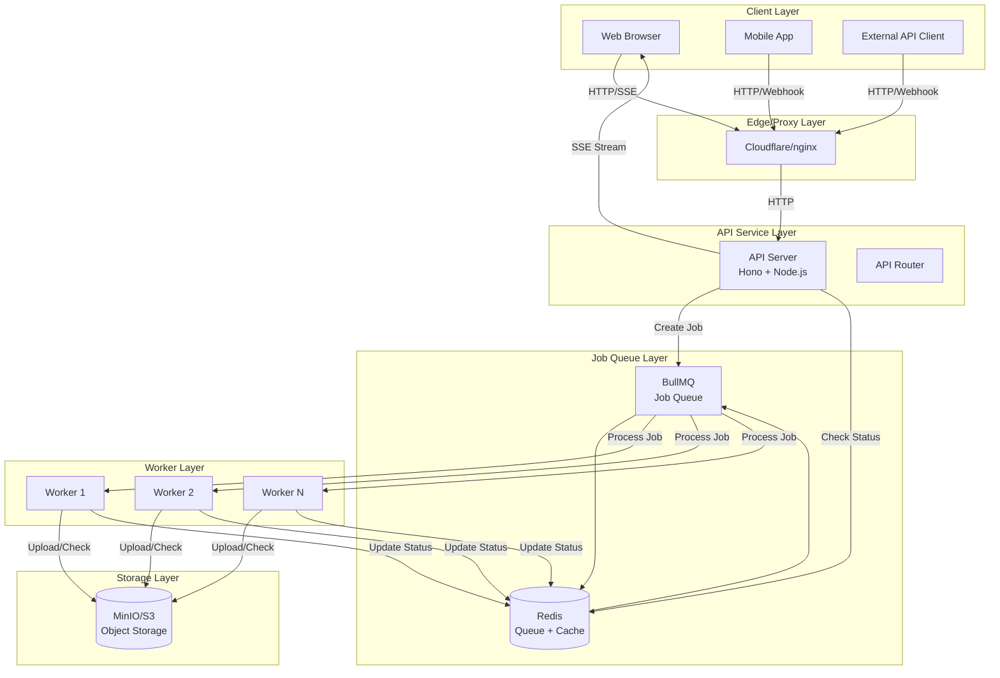
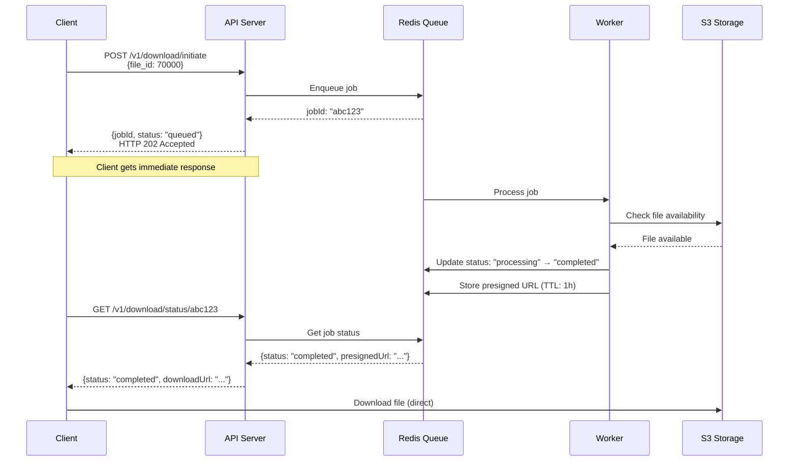
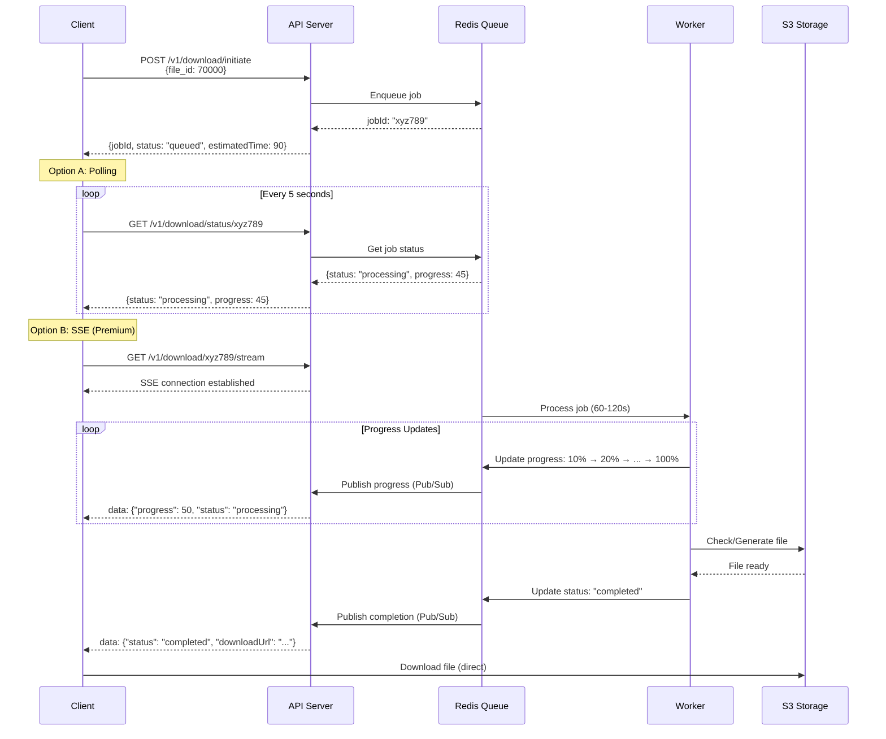

# Architecture Design: Long-Running Download System

## Executive Summary

This document presents a **Hybrid Architecture** solution for handling variable-duration file downloads (10-120 seconds) in a microservice environment. The solution addresses connection timeouts, poor user experience, resource exhaustion, and retry storms through asynchronous job processing, multiple client notification patterns, and robust error handling.

> **⚠️ Important**: This is an **architecture design document** for Challenge 2. It describes the design, approach, and implementation plan, but **does not include actual code implementation**. The actual implementation would follow this blueprint in a future phase.

---

## Table of Contents

1. [Problem Statement](#1-problem-statement)
2. [Architecture Diagram](#2-architecture-diagram)
3. [Technical Approach](#3-technical-approach)
4. [Implementation Details](#4-implementation-details)
5. [Proxy Configuration](#5-proxy-configuration)
6. [Frontend Integration](#6-frontend-integration)
7. [Edge Cases & Error Handling](#7-edge-cases--error-handling)
8. [Scaling & Performance](#8-scaling--performance)

---

## 1. Problem Statement

### Current Issues

The microservice handles file downloads with variable processing times:
- **Fast downloads**: Complete within ~10 seconds
- **Slow downloads**: Can take up to 120+ seconds

When deployed behind reverse proxies (Cloudflare, nginx, AWS ALB), critical issues arise:

1. **Connection Timeouts**: Proxies like Cloudflare default to 100s timeout, terminating long-running HTTP connections
2. **User Experience**: Users wait 2+ minutes with no feedback, leading to frustration
3. **Resource Exhaustion**: Holding HTTP connections open for extended periods consumes server memory
4. **Retry Storms**: Dropped connections trigger automatic retries, creating duplicate work

### Current Flow (Problematic)

```
Client → POST /v1/download/start → [Wait 60-120s] → Response
         ❌ Times out at 30s (REQUEST_TIMEOUT_MS)
         ❌ Proxy times out at 100s (Cloudflare)
         ❌ User sees 504 Gateway Timeout
```

---

## 2. Architecture Diagram

### 2.1 System Overview



### 2.2 Data Flow: Fast Download (< 15s)



### 2.3 Data Flow: Slow Download (60-120s)



---

## 3. Technical Approach

### 3.1 Pattern Evaluation

Before choosing our approach, we evaluated multiple patterns in the context of:
- **Infrastructure Constraints**: Single VM (2 vCPU, 8GB RAM)
- **Proxy Limitations**: Cloudflare (100s timeout), nginx configurable
- **S3 Integration**: MinIO from Challenge 1 with presigned URLs
- **Hackathon Constraints**: Limited time, need reliable solution
- **Frontend Compatibility**: React/Next.js web apps and mobile apps

#### Option A: Polling Pattern

**How it works:**
```
Client → POST /download/initiate → jobId
Client → GET /download/status/:jobId (every 5s)
Client → GET /download/:jobId (when ready)
```

**Pros:**
- ✅ Simple to implement (no persistent connections)
- ✅ Works with all HTTP clients (browsers, mobile, APIs)
- ✅ No special proxy configuration needed
- ✅ Resilient to network issues (each request is independent)
- ✅ Easy to debug (standard HTTP requests)
- ✅ Low infrastructure overhead (no WebSocket/SSE servers)

**Cons:**
- ❌ Less efficient (constant polling wastes bandwidth)
- ❌ Not truly real-time (delay equals poll interval)
- ❌ Higher server load (many status check requests)
- ❌ Battery drain on mobile devices

**Infrastructure Impact:**
- Minimal: Simple HTTP endpoints
- Redis for job status storage
- No persistent connections to manage

**Cost Implications:**
- Redis: ~100MB RAM, minimal CPU
- API server: Moderate CPU from polling requests
- **Total**: ~150MB RAM, 0.2 vCPU overhead

**Verdict**: Simple but inefficient. Good fallback option.

---

#### Option B: WebSocket/SSE Pattern

**How it works:**
```
Client → POST /download/initiate → jobId
Client → WS/SSE /download/subscribe/:jobId
Server → Real-time progress updates
Server → Completion notification
```

**Pros:**
- ✅ Real-time updates (instant feedback)
- ✅ Efficient (single connection, minimal overhead)
- ✅ Better UX (smooth progress bars)
- ✅ Low bandwidth usage (only sends updates when needed)

**Cons:**
- ❌ Requires persistent connections (memory overhead)
- ❌ Complex proxy configuration (timeouts, buffering)
- ❌ Not all clients support WebSocket/SSE (mobile apps need polyfills)
- ❌ Connection management complexity (reconnection, heartbeat)
- ❌ Higher memory usage (each connection ~10-20KB)

**Infrastructure Impact:**
- Higher: Persistent connections consume memory
- SSE easier than WebSocket (standard HTTP)
- Requires proxy timeout configuration

**Cost Implications:**
- Redis: ~100MB RAM (same as polling)
- API server: ~500MB RAM for 1000 concurrent SSE connections
- **Total**: ~600MB RAM, 0.3 vCPU overhead

**Verdict**: Best UX, but higher complexity and resource usage.

---

#### Option C: Webhook/Callback Pattern

**How it works:**
```
Client → POST /download/initiate { callbackUrl }
Server → Process asynchronously
Server → POST callbackUrl with result
```

**Pros:**
- ✅ Server-initiated (no polling needed)
- ✅ Efficient (one request, one callback)
- ✅ Perfect for backend-to-backend integrations
- ✅ No client-side connection management

**Cons:**
- ❌ Requires public endpoint (problematic for browsers)
- ❌ Not suitable for web frontend (can't receive webhooks)
- ❌ Complex error handling (webhook delivery failures)
- ❌ Security concerns (webhook URL validation)

**Infrastructure Impact:**
- Minimal: Standard HTTP endpoints
- Requires webhook delivery mechanism

**Cost Implications:**
- Redis: ~100MB RAM
- Webhook delivery queue: Additional ~50MB RAM
- **Total**: ~150MB RAM, 0.2 vCPU overhead

**Verdict**: Excellent for API clients, but not suitable for web frontends.

---

#### Option D: Hybrid Approach (Our Choice)

**How it works:**
```
Web Client: Polling (default) + SSE (optional premium)
Mobile App: Polling (battery efficient)
API Client: Webhook (backend integration)
```

**Pros:**
- ✅ **Flexibility**: Right tool for each use case
- ✅ **Compatibility**: Works everywhere (polling as universal fallback)
- ✅ **User Experience**: Real-time for web (SSE), efficient for mobile (polling)
- ✅ **Integration**: Webhooks for backend systems
- ✅ **Resilience**: If SSE fails, fallback to polling
- ✅ **Production-Ready**: Pattern used by GitHub, AWS, Stripe

**Cons:**
- ❌ More complex to implement (three patterns)
- ❌ Higher code complexity (multiple code paths)
- ❌ More testing required

**Infrastructure Impact:**
- Moderate: Supports all patterns but uses them selectively
- Can start with polling only, add SSE/webhooks incrementally

**Cost Implications:**
- Redis: ~100MB RAM
- API server: ~200MB RAM (polling baseline, SSE only when needed)
- **Total**: ~300MB RAM, 0.3 vCPU overhead (scales with usage)

**Verdict**: Best overall solution for hackathon constraints and production needs.

---

### 3.2 Decision Matrix

| Criteria | Polling | SSE/WebSocket | Webhook | **Hybrid** |
|----------|---------|---------------|---------|------------|
| **Simplicity** | ⭐⭐⭐⭐⭐ | ⭐⭐⭐ | ⭐⭐⭐⭐ | ⭐⭐⭐ |
| **UX (Web)** | ⭐⭐ | ⭐⭐⭐⭐⭐ | ❌ | ⭐⭐⭐⭐ |
| **UX (Mobile)** | ⭐⭐⭐⭐ | ⭐⭐⭐ | ⭐⭐⭐ | ⭐⭐⭐⭐ |
| **Infrastructure** | ⭐⭐⭐⭐⭐ | ⭐⭐⭐ | ⭐⭐⭐⭐ | ⭐⭐⭐⭐ |
| **Compatibility** | ⭐⭐⭐⭐⭐ | ⭐⭐⭐ | ⭐⭐⭐ | ⭐⭐⭐⭐⭐ |
| **Cost (RAM)** | ~150MB | ~600MB | ~150MB | **~300MB** |
| **Proxy Config** | ✅ Easy | ⚠️ Complex | ✅ Easy | ⚠️ Moderate |

**Winner**: **Hybrid Approach** - Best balance of UX, compatibility, and infrastructure efficiency.

---

### 3.3 Infrastructure Constraints Consideration

Given the constraint of a **single VM (2 vCPU, 8GB RAM)**, our hybrid approach:

1. **Memory Efficient**: 
   - Redis: ~100MB
   - API server: ~200-300MB (polling baseline)
   - Workers: ~200MB
   - MinIO: ~200MB
   - **Total**: ~800MB-1GB (well within 8GB limit)

2. **CPU Efficient**:
   - Polling: Low CPU overhead (simple Redis lookups)
   - SSE: Only when clients actively use it
   - Workers: Process jobs asynchronously

3. **Scalable**:
   - Can handle 100+ concurrent users with polling
   - SSE adds overhead only when used
   - Workers can scale horizontally if needed

4. **Cost-Effective**:
   - Self-hosted Redis (free)
   - No external services needed
   - Single VM handles entire stack

---

### 3.4 Chosen Approach: Hybrid Pattern (Option D)

We chose a **Hybrid Approach** combining:
- **Polling Pattern** (default, simple, universal support) - **Primary for mobile and simple web apps**
- **Server-Sent Events (SSE)** (real-time updates for premium users) - **Optional for web apps**
- **Webhook Pattern** (backend-to-backend integrations) - **For API clients**

**Implementation Strategy:**
- **Phase 1**: Implement polling (works immediately, universal support)
- **Phase 2**: Add SSE support (enhanced UX for web users)
- **Phase 3**: Add webhook support (backend integrations)

This phased approach allows us to deliver a working solution quickly while leaving room for enhancement.

### 3.5 Technology Stack & Rationale

#### Job Queue: Redis + BullMQ

**Why Redis + BullMQ?**
- ✅ **Self-hosted**: Free on single VM (vs AWS SQS: $0.40/million requests)
- ✅ **Lightweight**: ~100MB RAM, minimal CPU
- ✅ **Fast**: In-memory operations (microsecond latency)
- ✅ **Reliable**: Built-in persistence (RDB snapshots)
- ✅ **Feature-rich**: BullMQ provides retry logic, priorities, delays
- ✅ **Hackathon-friendly**: No cloud account needed, works locally

**Alternatives Considered:**
- **AWS SQS**: ❌ Requires AWS account, costs money, external dependency
- **RabbitMQ**: ⚠️ Heavier (~300MB RAM), overkill for this use case
- **Database polling**: ❌ Higher latency, database load
- **In-memory queue**: ❌ No persistence, lost on restart

**Cost**: Free (self-hosted) vs $10-50/month (managed Redis) or $0.40/million requests (SQS)

---

#### Cache/Storage: Redis (same instance)

**Why same Redis instance?**
- ✅ **Efficiency**: Reuse existing Redis connection
- ✅ **Cost**: No additional infrastructure
- ✅ **Performance**: Local access, sub-millisecond latency
- ✅ **Pub/Sub**: Built-in support for SSE real-time updates

**Data Structures:**
- **Hash**: Job status storage (`job:status:{jobId}`)
- **Set**: User job lists (`user:jobs:{userId}`)
- **Sorted Set**: Rate limiting (`rate:limit:user:{userId}`)
- **Pub/Sub**: Real-time progress updates

**Memory Usage**: ~50MB for 10,000 jobs (with 24h TTL)

---

#### Object Storage: MinIO/S3 (Challenge 1 Integration)

**Why Presigned URLs?**
- ✅ **Direct Downloads**: Bypass API server, reduce bandwidth costs
- ✅ **Scalability**: S3 handles download traffic, not API server
- ✅ **Performance**: CDN-like performance for file downloads
- ✅ **Security**: Time-limited access (1 hour TTL)
- ✅ **Cost**: API server only generates URL, doesn't stream files

**Integration with Challenge 1:**
- Uses existing MinIO setup from Challenge 1
- Bucket: `downloads` (already created)
- Access via `S3_ENDPOINT=http://minio:9000`
- Presigned URLs valid for 1 hour (configurable)

**Cost**: Free (self-hosted MinIO) vs AWS S3 pricing if using cloud

---

#### API Framework: Hono (Existing)

- Fast HTTP framework
- Built-in SSE support (`streamSSE`)
- Type-safe routes with Zod validation
- OpenAPI integration (existing)

No changes needed to framework choice.

---

### 3.6 Cost Analysis

#### Infrastructure Cost Breakdown (Single VM: 2 vCPU, 8GB RAM)

| Component | RAM Usage | CPU Usage | Cost (Self-Hosted) | Cost (Managed) |
|-----------|-----------|-----------|-------------------|----------------|
| API Server | ~200MB | 0.2 vCPU | Free | $5-10/month |
| Redis | ~100MB | 0.1 vCPU | Free | $10-20/month |
| Workers | ~200MB | 0.3 vCPU | Free | Included in API |
| MinIO | ~200MB | 0.2 vCPU | Free | $5-15/month |
| **Total** | **~700MB** | **~0.8 vCPU** | **Free** | **$20-45/month** |

**Self-Hosted Total**: $0 (uses existing VM)  
**Managed Cloud Total**: ~$20-45/month (if using managed services)

#### Operational Cost Considerations

1. **Storage**: MinIO storage costs (depends on file sizes)
2. **Bandwidth**: Presigned URLs reduce API bandwidth (direct S3 downloads)
3. **Scaling**: Can scale horizontally (add workers) without code changes
4. **Monitoring**: Use existing observability (Challenge 4)

**Recommendation**: Start with self-hosted, migrate to managed services if needed.

---

## 4. Implementation Details

> **⚠️ Important Note**: This section describes the **architecture and design** only. This is a design document for Challenge 2, not an implementation. The actual code changes would be implemented in a future phase, following this architectural blueprint.

### 4.1 API Contract Changes

#### Analysis of Existing Endpoints

Before designing new endpoints, we analyzed the current API implementation in `src/index.ts`:

| Endpoint | Current Behavior | HTTP Status | Issues | Proposed Action |
|----------|------------------|-------------|--------|-----------------|
| `POST /v1/download/initiate` | Returns `jobId` immediately (no processing) | 200 | Returns jobId but doesn't actually process | **Enhance** - Keep structure, add background processing |
| `POST /v1/download/check` | Synchronously checks S3 file availability | 200 | Works fine for quick checks | **Keep as-is** - No changes needed |
| `POST /v1/download/start` | Processes download with 10-120s delay synchronously | 200 (but times out) | **⚠️ Main problem** - Blocks for 10-120s, times out at 30s | **Deprecate** - Replace with async job pattern or mark as legacy |

**Current Implementation Analysis:**

```typescript
// Current: src/index.ts
app.openapi(downloadInitiateRoute, (c) => {
  const { file_ids } = c.req.valid("json");
  const jobId = crypto.randomUUID();  // ✅ Already returns jobId
  return c.json({
    jobId,
    status: "queued",
    totalFileIds: file_ids.length,
  }, 200);
});
```

**Key Insight**: The existing `/v1/download/initiate` endpoint already returns a `jobId`, which is perfect for our async architecture. We need to:
1. Keep the endpoint structure (backward compatible)
2. Add background job creation when this endpoint is called
3. Return immediately (as it does now)
4. Process the job asynchronously

#### Existing Endpoints (To Be Enhanced)

**POST /v1/download/initiate** (Currently exists - Enhance with background processing)
```typescript
// Request
{
  file_ids: number[]  // Existing
  callbackUrl?: string  // New: For webhook pattern
}

// Response
{
  jobId: string
  status: "queued" | "processing"
  totalFileIds: number
  estimatedTime?: number  // New: Estimated completion time in seconds
  message?: string
}
```

#### New Endpoints

**GET /v1/download/status/:jobId**
```typescript
// Response
{
  jobId: string
  status: "queued" | "processing" | "completed" | "failed"
  progress: number  // 0-100
  fileId?: number
  downloadUrl?: string  // Presigned S3 URL
  error?: string
  createdAt: string  // ISO 8601
  completedAt?: string  // ISO 8601
  estimatedCompletion?: string  // ISO 8601
}
```

**GET /v1/download/:jobId/stream** (SSE)
```
Content-Type: text/event-stream

data: {"progress": 25, "status": "processing"}

data: {"progress": 50, "status": "processing"}

data: {"progress": 100, "status": "completed", "downloadUrl": "https://..."}
```

**GET /v1/download/:jobId** (Download result)
```typescript
// If completed, returns presigned URL or redirects
// If not ready, returns status
{
  status: "queued" | "processing"
  progress: number
  // OR redirects to presigned URL if completed
}
```

**DELETE /v1/download/:jobId** (Cancel job)
```typescript
// Response
{
  jobId: string
  status: "cancelled"
  message: "Job cancelled successfully"
}
```

### 4.2 Database/Cache Schema

#### Redis Data Structures

**Job Status (Hash)**
```
Key: job:status:{jobId}
Fields:
  - jobId: string (UUID)
  - fileId: number
  - userId?: string
  - status: "queued" | "processing" | "completed" | "failed" | "cancelled"
  - progress: number (0-100)
  - s3Key?: string
  - presignedUrl?: string
  - error?: string
  - createdAt: string (ISO 8601)
  - completedAt?: string (ISO 8601)
  - estimatedCompletion?: string (ISO 8601)
  - callbackUrl?: string (for webhooks)
TTL: 24 hours (after completion)
```

**Job Queue (BullMQ)**
```
Queue: download-jobs
Job Data:
  - jobId: string
  - fileId: number
  - userId?: string
  - callbackUrl?: string
Job Options:
  - attempts: 3
  - backoff: { type: "exponential", delay: 5000 }
  - removeOnComplete: true
  - removeOnFail: false (for debugging)
```

**User Job List (Set)**
```
Key: user:jobs:{userId}
Members: [jobId1, jobId2, ...]
TTL: 7 days
```

**Rate Limiting (Counter)**
```
Key: rate:limit:user:{userId}:window:{windowStart}
Value: number of jobs created in window
TTL: 60 seconds (window size)
```

### 4.3 Background Job Processing Strategy

#### Worker Process Architecture

```typescript
// Worker Service (separate process or same container with PM2)
import { Worker, Job } from 'bullmq';
import { Queue } from 'bullmq';
import { RedisConnection } from './redis';

const downloadQueue = new Queue('download-jobs', {
  connection: RedisConnection
});

const worker = new Worker('download-jobs', async (job: Job) => {
  const { jobId, fileId, callbackUrl } = job.data;
  
  try {
    // Update status to processing
    await updateJobStatus(jobId, {
      status: 'processing',
      progress: 0
    });
    
    // Simulate processing (or actual file generation)
    const estimatedTime = getEstimatedTime(fileId);
    const chunks = 10; // Progress updates
    
    for (let i = 1; i <= chunks; i++) {
      // Simulate work
      await sleep(estimatedTime / chunks);
      
      // Update progress
      await updateJobStatus(jobId, {
        progress: (i / chunks) * 100
      });
      
      // Publish progress via Redis Pub/Sub for SSE
      await redis.publish(`job:${jobId}`, JSON.stringify({
        progress: (i / chunks) * 100,
        status: 'processing'
      }));
    }
    
    // Check/generate file in S3
    const s3Result = await checkS3Availability(fileId);
    
    if (s3Result.available) {
      // Generate presigned URL (1 hour TTL)
      const presignedUrl = await generatePresignedUrl(s3Result.s3Key, 3600);
      
      // Update status to completed
      await updateJobStatus(jobId, {
        status: 'completed',
        progress: 100,
        downloadUrl: presignedUrl,
        completedAt: new Date().toISOString()
      });
      
      // Trigger webhook if provided
      if (callbackUrl) {
        await triggerWebhook(callbackUrl, {
          jobId,
          status: 'completed',
          downloadUrl: presignedUrl
        });
      }
      
      // Publish completion
      await redis.publish(`job:${jobId}`, JSON.stringify({
        status: 'completed',
        downloadUrl: presignedUrl
      }));
      
    } else {
      throw new Error('File not available in S3');
    }
    
  } catch (error) {
    // Update status to failed
    await updateJobStatus(jobId, {
      status: 'failed',
      error: error.message
    });
    
    // Trigger webhook if provided
    if (callbackUrl) {
      await triggerWebhook(callbackUrl, {
        jobId,
        status: 'failed',
        error: error.message
      });
    }
    
    throw error; // BullMQ will retry
  }
}, {
  connection: RedisConnection,
  concurrency: 5, // Process 5 jobs concurrently
  limiter: {
    max: 10,
    duration: 1000 // Max 10 jobs per second
  }
});
```

#### Worker Scaling

- **Horizontal Scaling**: Run multiple worker instances
- **Concurrency**: Each worker processes N jobs concurrently
- **Priority Queues**: High-priority jobs processed first
- **Worker Health**: Monitor worker process health

### 4.4 Error Handling & Retry Logic

#### Retry Strategy

```typescript
// BullMQ Job Options
{
  attempts: 3,  // Max 3 attempts
  backoff: {
    type: 'exponential',
    delay: 5000  // 5s, 10s, 20s delays
  },
  removeOnFail: false  // Keep failed jobs for debugging
}
```

#### Error Categories

1. **Transient Errors** (retry)
   - Network timeouts
   - S3 temporary unavailability
   - Redis connection issues
   - Worker process crashes

2. **Permanent Errors** (fail immediately)
   - Invalid file ID
   - Authentication failures
   - File not found (after verification)
   - Malformed request

3. **User Cancellation**
   - User explicitly cancels job
   - No retry

#### Error Response Format

```typescript
{
  jobId: string
  status: "failed"
  error: string
  errorCode?: string  // "FILE_NOT_FOUND", "TIMEOUT", etc.
  retryable: boolean
  retriesRemaining: number
}
```

### 4.5 Idempotency & Duplicate Prevention Strategy

#### Problem Statement

When clients retry requests (due to timeouts, network failures, or user actions), we must ensure:
1. **No duplicate job processing** - Same request doesn't create multiple jobs
2. **No duplicate work** - Same file doesn't get processed multiple times
3. **Idempotent operations** - Repeated requests return same result
4. **Retry safety** - Client retries don't create duplicate work

#### Multi-Layer Idempotency Strategy

**Layer 1: Client-Side Idempotency Key (Optional but Recommended)**

```typescript
// Client provides unique idempotency key per request
POST /v1/download/initiate
{
  "file_ids": [70000],
  "idempotency_key": "client-uuid-abc123"  // Optional, client-generated UUID
}

// Server implementation
async function initiateDownload(request) {
  const { file_ids, idempotency_key } = request;
  
  // If idempotency key provided, check for existing job
  if (idempotency_key) {
    const existingJobId = await redis.get(`idempotency:${idempotency_key}`);
    if (existingJobId) {
      const existingJob = await getJobStatus(existingJobId);
      // Return existing job (even if completed)
      return {
        jobId: existingJobId,
        status: existingJob.status,
        message: "Existing job found for this idempotency key"
      };
    }
  }
  
  // Create new job...
  const jobId = crypto.randomUUID();
  
  // Store idempotency key mapping (TTL: 24 hours)
  if (idempotency_key) {
    await redis.setex(
      `idempotency:${idempotency_key}`,
      86400, // 24 hours
      jobId
    );
  }
  
  return { jobId, status: "queued" };
}
```

**Benefits:**
- Client controls idempotency
- Works across different sessions/devices
- Prevents accidental duplicate requests
- TTL prevents infinite storage growth

---

**Layer 2: Server-Side Deduplication (File ID + User ID)**

```typescript
// Check for existing active job for same file + user
async function checkExistingJob(fileId: number, userId?: string) {
  // Create deterministic key
  const jobKey = userId 
    ? `job:active:file:${fileId}:user:${userId}`
    : `job:active:file:${fileId}`;
  
  const existingJobId = await redis.get(jobKey);
  
  if (existingJobId) {
    const jobStatus = await getJobStatus(existingJobId);
    
    // If job is still active (not completed/failed), return it
    if (jobStatus.status === 'queued' || jobStatus.status === 'processing') {
      return {
        existing: true,
        jobId: existingJobId,
        status: jobStatus.status
      };
    }
    
    // If job completed recently, check if result is still valid
    if (jobStatus.status === 'completed') {
      const completedAt = new Date(jobStatus.completedAt);
      const ageMinutes = (Date.now() - completedAt.getTime()) / 60000;
      
      // If completed within last hour and URL still valid
      if (ageMinutes < 60 && jobStatus.downloadUrl) {
        return {
          existing: true,
          jobId: existingJobId,
          status: 'completed',
          downloadUrl: jobStatus.downloadUrl,
          reuse: true
        };
      }
    }
  }
  
  return { existing: false };
}

// In initiate endpoint
const existing = await checkExistingJob(fileId, userId);
if (existing.existing) {
  return {
    jobId: existing.jobId,
    status: existing.status,
    downloadUrl: existing.downloadUrl,
    message: existing.reuse ? "Reusing existing completed job" : "Existing job in progress"
  };
}
```

**Benefits:**
- Prevents duplicate processing of same file for same user
- Reuses completed results within TTL window
- No client coordination needed

---

**Layer 3: BullMQ Job Deduplication (Queue-Level)**

```typescript
// Use deterministic job IDs in BullMQ
async function enqueueDownloadJob(jobId: string, fileId: number, userId?: string) {
  // Create deterministic job ID for BullMQ
  const bullJobId = userId 
    ? `download-${fileId}-${userId}`
    : `download-${fileId}`;
  
  // Check if job already in queue
  const existingJob = await downloadQueue.getJob(bullJobId);
  if (existingJob) {
    const state = await existingJob.getState();
    if (state === 'waiting' || state === 'active') {
      // Job already queued or processing
      return { alreadyQueued: true, jobId: existingJob.id };
    }
  }
  
  // Add job with deterministic ID (BullMQ prevents duplicates)
  await downloadQueue.add(
    'process-download',
    { jobId, fileId, userId },
    {
      jobId: bullJobId,  // Deterministic ID prevents duplicates
      removeOnComplete: {
        age: 86400,  // Remove completed jobs after 24h
        count: 1000  // Keep last 1000 jobs
      },
      removeOnFail: {
        age: 604800  // Keep failed jobs for 7 days
      }
    }
  );
  
  return { alreadyQueued: false };
}
```

**Benefits:**
- Queue-level deduplication
- Prevents duplicate jobs even if API called multiple times
- BullMQ handles deduplication automatically

---

**Layer 4: Worker-Level Idempotency (Processing-Level)**

```typescript
// Worker checks before processing
const worker = new Worker('download-jobs', async (job) => {
  const { jobId, fileId, userId } = job.data;
  
  // Acquire distributed lock (prevents concurrent processing of same file)
  const lockKey = `lock:process:file:${fileId}`;
  const lock = await acquireLock(lockKey, 300); // 5 minute lock
  
  if (!lock) {
    // Another worker is processing this file
    // Wait and check if result exists
    await sleep(1000);
    const existingResult = await getJobResultForFile(fileId);
    if (existingResult) {
      await updateJobStatus(jobId, existingResult);
      return; // Skip processing
    }
    // Retry acquiring lock
    throw new Error('Lock acquisition failed, will retry');
  }
  
  try {
    // Double-check: Has this file been processed?
    const existingResult = await redis.get(`result:file:${fileId}:completed`);
    if (existingResult) {
      const result = JSON.parse(existingResult);
      // Update this job with existing result
      await updateJobStatus(jobId, {
        status: 'completed',
        downloadUrl: result.downloadUrl,
        s3Key: result.s3Key,
        completedAt: result.completedAt
      });
      return; // Skip processing, reuse result
    }
    
    // Process file...
    const result = await processFileDownload(fileId);
    
    // Store result for future reuse (TTL: 1 hour)
    await redis.setex(
      `result:file:${fileId}:completed`,
      3600,
      JSON.stringify(result)
    );
    
    // Update job status
    await updateJobStatus(jobId, {
      status: 'completed',
      ...result
    });
    
  } finally {
    // Release lock
    await releaseLock(lockKey, lock);
  }
});

// Distributed lock implementation (Redis-based)
async function acquireLock(key: string, ttlSeconds: number): Promise<string | null> {
  const lockValue = crypto.randomUUID();
  const acquired = await redis.set(key, lockValue, 'EX', ttlSeconds, 'NX');
  return acquired ? lockValue : null;
}

async function releaseLock(key: string, lockValue: string): Promise<void> {
  // Lua script for atomic lock release
  const script = `
    if redis.call("get", KEYS[1]) == ARGV[1] then
      return redis.call("del", KEYS[1])
    else
      return 0
    end
  `;
  await redis.eval(script, 1, key, lockValue);
}
```

**Benefits:**
- Prevents concurrent processing of same file by multiple workers
- Reuses existing results (even across different job IDs)
- Distributed lock ensures only one worker processes at a time

---

**Layer 5: Request-Level Deduplication (API Endpoint)**

```typescript
// Rate limiting + deduplication at API level
app.post('/v1/download/initiate', async (c) => {
  const { file_ids, idempotency_key } = await c.req.json();
  const userId = c.get('userId'); // From auth middleware
  
  // Create request fingerprint
  const requestFingerprint = crypto
    .createHash('sha256')
    .update(JSON.stringify({ file_ids, userId, idempotency_key }))
    .digest('hex');
  
  // Check recent requests (last 60 seconds)
  const recentRequest = await redis.get(`request:${requestFingerprint}`);
  if (recentRequest) {
    const recentJobId = JSON.parse(recentRequest).jobId;
    return c.json({
      jobId: recentJobId,
      status: "queued",
      message: "Duplicate request detected, returning existing job"
    }, 200);
  }
  
  // Process request...
  const result = await initiateDownload({ file_ids, idempotency_key, userId });
  
  // Cache request fingerprint (60 seconds TTL)
  await redis.setex(
    `request:${requestFingerprint}`,
    60,
    JSON.stringify({ jobId: result.jobId, timestamp: Date.now() })
  );
  
  return c.json(result, 202);
});
```

**Benefits:**
- Prevents duplicate requests within short time window
- Handles rapid-fire retries
- Works even without client-side idempotency keys

---

#### Idempotency Summary Table

| Layer | Mechanism | Scope | TTL | Prevents |
|-------|-----------|-------|-----|----------|
| **Client** | Idempotency Key | Per client request | 24h | Duplicate requests from same client |
| **Server (File+User)** | File ID + User ID mapping | Per file per user | Job lifetime | Same file processed twice for same user |
| **Queue** | Deterministic Job ID | Per file (or file+user) | Job lifetime | Duplicate jobs in queue |
| **Worker** | Distributed Lock + Result Cache | Per file | 1h (results) | Concurrent processing, duplicate work |
| **API** | Request Fingerprint | Per request | 60s | Rapid duplicate API calls |

#### Result

With all layers combined:
- ✅ Same request returns same `jobId`
- ✅ Same file processed once (results reused)
- ✅ Retries are safe (no duplicate work)
- ✅ Concurrent requests handled gracefully
- ✅ Client-side and server-side protection

**Example Flow:**
```
Request 1: POST /initiate {file_id: 70000, idempotency_key: "abc"}
→ Creates job-123

Request 2: POST /initiate {file_id: 70000, idempotency_key: "abc"} (retry)
→ Returns job-123 (Layer 1: idempotency key)

Request 3: POST /initiate {file_id: 70000} (different client, no key)
→ Returns job-123 (Layer 2: file+user deduplication)

Worker starts processing job-123...

Request 4: POST /initiate {file_id: 70000} (another retry)
→ Returns job-123 (Layer 4: existing active job)

Worker completes, stores result...

Request 5: POST /initiate {file_id: 70000} (1 hour later, new request)
→ Creates job-456, but worker reuses result from job-123 (Layer 4: result cache)
```

---

### 4.6 Presigned S3 URLs (Challenge 1 Integration)

#### Why Presigned URLs?

**Direct Download Benefits:**
- ✅ **Offload API Server**: Files downloaded directly from S3, not through API
- ✅ **Reduced Bandwidth**: API server only handles metadata, not file streams
- ✅ **Better Performance**: S3 optimized for file serving
- ✅ **Cost Efficient**: No API server bandwidth costs for file downloads
- ✅ **Scalable**: S3 handles concurrent downloads efficiently

#### Implementation

```typescript
// Generate presigned URL after file processing
import { GetObjectCommand, S3Client } from '@aws-sdk/client-s3';
import { getSignedUrl } from '@aws-sdk/s3-request-presigner';

async function generatePresignedUrl(s3Key: string, expirationSeconds: number = 3600): Promise<string> {
  const command = new GetObjectCommand({
    Bucket: env.S3_BUCKET_NAME, // "downloads" from Challenge 1
    Key: s3Key, // e.g., "files/70000"
  });

  // Generate URL valid for 1 hour
  const presignedUrl = await getSignedUrl(s3Client, command, {
    expiresIn: expirationSeconds,
  });

  return presignedUrl;
}
```

#### Presigned URL Lifecycle

1. **Generation**: Worker generates presigned URL when job completes
2. **Storage**: URL stored in Redis job status (TTL: 24 hours)
3. **Retrieval**: Client gets URL from status endpoint
4. **Expiration**: URL expires after 1 hour
5. **Regeneration**: If expired, generate new URL on status check

```typescript
// On status check, regenerate if expired
async function getDownloadUrl(jobId: string): Promise<string | null> {
  const job = await getJobStatus(jobId);
  
  if (job.status !== 'completed' || !job.s3Key) {
    return null;
  }
  
  // Check if existing URL is still valid
  if (job.downloadUrl && !isUrlExpired(job.downloadUrl)) {
    return job.downloadUrl;
  }
  
  // Regenerate if expired
  const newUrl = await generatePresignedUrl(job.s3Key, 3600);
  await updateJobStatus(jobId, { downloadUrl: newUrl });
  return newUrl;
}
```

#### Integration with MinIO (Challenge 1)

- **Endpoint**: Uses `S3_ENDPOINT=http://minio:9000` from Challenge 1
- **Bucket**: Uses `downloads` bucket created in Challenge 1
- **Credentials**: Uses same credentials from Challenge 1
- **Compatibility**: Works with MinIO's S3-compatible API

**Example Presigned URL:**
```
http://minio:9000/downloads/files/70000?X-Amz-Algorithm=...
```

**Note**: In production, MinIO would be behind a domain:
```
https://storage.example.com/downloads/files/70000?...
```

### 4.5 Timeout Configuration

| Layer | Timeout | Configuration |
|-------|---------|---------------|
| **Client** | 30s (initial request) | `REQUEST_TIMEOUT_MS` |
| **Reverse Proxy** | 600s (SSE connections) | `proxy_read_timeout` |
| **API Server** | 30s (HTTP), 600s (SSE) | Hono timeout middleware |
| **Worker Process** | 300s (per job) | BullMQ job timeout |
| **Redis** | 5s (connection) | Redis client config |
| **S3** | 60s (per operation) | AWS SDK config |
| **Presigned URL** | 3600s (1 hour) | S3 URL expiration |

---

## 5. Proxy Configuration

### 5.1 Cloudflare Configuration

#### Timeout Settings

**Page Rules** (if using Cloudflare):
```
URL Pattern: *api.example.com/v1/download/*
Settings:
  - Cache Level: Bypass
  - Disable Performance
```

**Workers/Transform Rules** (Recommended):
```javascript
// Increase timeout for SSE endpoints
if (request.url.includes('/v1/download/') && 
    request.url.includes('/stream')) {
  // Allow long-running connections
  // Cloudflare default: 100s, increase via Workers
}
```

#### WebSocket/SSE Support

- Cloudflare supports SSE by default
- No special configuration needed for SSE
- WebSocket support requires Workers (for future WebSocket upgrades)

#### Best Practices

1. **Cache Control**: Disable caching for job status endpoints
2. **Rate Limiting**: Configure rate limits at Cloudflare level
3. **Always Online**: Disable for API endpoints (only for static assets)

### 5.2 Nginx Configuration

#### Complete Nginx Config

```nginx
upstream api_backend {
    server api-service:3000;
    keepalive 32;
}

server {
    listen 80;
    server_name api.example.com;

    # General proxy settings
    proxy_http_version 1.1;
    proxy_set_header Host $host;
    proxy_set_header X-Real-IP $remote_addr;
    proxy_set_header X-Forwarded-For $proxy_add_x_forwarded_for;
    proxy_set_header X-Forwarded-Proto $scheme;
    proxy_set_header Connection "";

    # Increase timeouts for long-running requests
    proxy_connect_timeout 60s;
    proxy_send_timeout 600s;
    proxy_read_timeout 600s;
    send_timeout 600s;

    # Don't buffer responses (important for SSE)
    proxy_buffering off;
    proxy_cache off;

    # Regular API endpoints
    location /v1/ {
        proxy_pass http://api_backend;
        proxy_set_header Connection "";
    }

    # SSE endpoint - special configuration
    location ~ ^/v1/download/[^/]+/stream$ {
        proxy_pass http://api_backend;
        proxy_http_version 1.1;
        proxy_set_header Connection '';
        proxy_buffering off;
        proxy_cache off;
        proxy_read_timeout 600s;
        
        # Important for SSE
        chunked_transfer_encoding on;
        proxy_set_header X-Accel-Buffering no;
    }

    # Job status endpoints - no caching
    location ~ ^/v1/download/[^/]+/status$ {
        proxy_pass http://api_backend;
        add_header Cache-Control "no-cache, no-store, must-revalidate";
        add_header Pragma "no-cache";
        add_header Expires "0";
    }

    # Health check - fast timeout
    location /health {
        proxy_pass http://api_backend;
        proxy_read_timeout 5s;
    }
}
```

#### Key Settings Explained

- **`proxy_read_timeout 600s`**: Allow 10-minute connections for SSE
- **`proxy_buffering off`**: Don't buffer SSE streams
- **`chunked_transfer_encoding on`**: Required for SSE
- **`X-Accel-Buffering no`**: Disable Nginx buffering

### 5.3 AWS Application Load Balancer (ALB)

#### Target Group Configuration

```yaml
Target Group Settings:
  - Health Check Path: /health
  - Health Check Interval: 30s
  - Health Check Timeout: 5s
  - Healthy Threshold: 2
  - Unhealthy Threshold: 3
  
  - Deregistration Delay: 30s
  - Connection Draining: Enabled
```

#### Listener Rules

```yaml
Rule 1: Path-based routing for SSE
  Condition: Path is /v1/download/*/stream
  Action: Forward to API target group
  Settings:
    - Idle Timeout: 600 seconds
    - Stickiness: Disabled

Rule 2: Default
  Action: Forward to API target group
  Settings:
    - Idle Timeout: 60 seconds
```

---

## 6. Frontend Integration

### 6.1 React/Next.js Implementation

#### Download Initiation Component

```typescript
// hooks/useDownload.ts
import { useState, useEffect, useCallback } from 'react';
import { useQuery, useMutation } from '@tanstack/react-query';

interface DownloadJob {
  jobId: string;
  status: 'queued' | 'processing' | 'completed' | 'failed';
  progress: number;
  downloadUrl?: string;
  error?: string;
}

export function useDownload(fileId: number) {
  const [jobId, setJobId] = useState<string | null>(null);

  // Initiate download
  const initiateMutation = useMutation({
    mutationFn: async (fileId: number) => {
      const response = await fetch('/api/v1/download/initiate', {
        method: 'POST',
        headers: { 'Content-Type': 'application/json' },
        body: JSON.stringify({ file_ids: [fileId] })
      });
      const data = await response.json();
      setJobId(data.jobId);
      return data;
    }
  });

  // Poll job status (fallback)
  const { data: jobStatus, refetch } = useQuery({
    queryKey: ['download', jobId],
    queryFn: async () => {
      if (!jobId) return null;
      const response = await fetch(`/api/v1/download/status/${jobId}`);
      return response.json() as Promise<DownloadJob>;
    },
    enabled: !!jobId && !jobStatus?.downloadUrl,
    refetchInterval: (query) => {
      const status = query.state.data?.status;
      // Stop polling if completed or failed
      if (status === 'completed' || status === 'failed') {
        return false;
      }
      // Poll every 5 seconds
      return 5000;
    }
  });

  // SSE connection (premium feature)
  useEffect(() => {
    if (!jobId || jobStatus?.status === 'completed') return;

    const eventSource = new EventSource(`/api/v1/download/${jobId}/stream`);

    eventSource.onmessage = (event) => {
      const data = JSON.parse(event.data);
      // Update job status from SSE
      refetch();
    };

    eventSource.onerror = () => {
      // Fallback to polling if SSE fails
      eventSource.close();
    };

    return () => {
      eventSource.close();
    };
  }, [jobId, refetch]);

  const startDownload = useCallback(() => {
    initiateMutation.mutate(fileId);
  }, [fileId, initiateMutation]);

  return {
    startDownload,
    jobId,
    jobStatus,
    isLoading: initiateMutation.isPending,
    isProcessing: jobStatus?.status === 'processing',
    isCompleted: jobStatus?.status === 'completed',
    progress: jobStatus?.progress || 0,
    downloadUrl: jobStatus?.downloadUrl,
    error: jobStatus?.error
  };
}
```

#### Download Button Component

```typescript
// components/DownloadButton.tsx
import React from 'react';
import { useDownload } from '../hooks/useDownload';

interface DownloadButtonProps {
  fileId: number;
}

export function DownloadButton({ fileId }: DownloadButtonProps) {
  const {
    startDownload,
    isLoading,
    isProcessing,
    isCompleted,
    progress,
    downloadUrl,
    error
  } = useDownload(fileId);

  useEffect(() => {
    if (isCompleted && downloadUrl) {
      // Auto-download or open in new tab
      window.open(downloadUrl, '_blank');
    }
  }, [isCompleted, downloadUrl]);

  if (isCompleted) {
    return (
      <a
        href={downloadUrl}
        download
        className="btn btn-success"
      >
        Download File
      </a>
    );
  }

  if (error) {
    return (
      <div className="alert alert-danger">
        <p>Download failed: {error}</p>
        <button onClick={startDownload} className="btn btn-primary">
          Retry
        </button>
      </div>
    );
  }

  return (
    <div>
      <button
        onClick={startDownload}
        disabled={isLoading || isProcessing}
        className="btn btn-primary"
      >
        {isLoading ? 'Starting...' : 'Download File'}
      </button>

      {isProcessing && (
        <div className="progress mt-2">
          <div
            className="progress-bar progress-bar-striped progress-bar-animated"
            style={{ width: `${progress}%` }}
          >
            {progress}%
          </div>
        </div>
      )}
    </div>
  );
}
```

### 6.2 Progress Feedback

#### Progress Bar Implementation

```typescript
// components/ProgressBar.tsx
interface ProgressBarProps {
  progress: number;
  status: string;
  estimatedTime?: number;
}

export function ProgressBar({ progress, status, estimatedTime }: ProgressBarProps) {
  return (
    <div className="progress-container">
      <div className="progress">
        <div
          className="progress-bar"
          role="progressbar"
          style={{ width: `${progress}%` }}
          aria-valuenow={progress}
          aria-valuemin={0}
          aria-valuemax={100}
        >
          {progress}%
        </div>
      </div>
      <div className="progress-info">
        <span className="status">{status}</span>
        {estimatedTime && (
          <span className="time">Estimated: {estimatedTime}s remaining</span>
        )}
      </div>
    </div>
  );
}
```

### 6.3 Handling Completion & Failure

#### Success Handling

```typescript
// Auto-download on completion
useEffect(() => {
  if (jobStatus?.status === 'completed' && jobStatus.downloadUrl) {
    // Option 1: Direct download
    const link = document.createElement('a');
    link.href = jobStatus.downloadUrl;
    link.download = `file-${fileId}.zip`;
    link.click();

    // Option 2: Open in new tab
    // window.open(jobStatus.downloadUrl, '_blank');

    // Option 3: Show success modal with download link
    // showSuccessModal(jobStatus.downloadUrl);
  }
}, [jobStatus, fileId]);
```

#### Error Handling & Retry

```typescript
// Error handling with exponential backoff retry
const [retryCount, setRetryCount] = useState(0);

const handleRetry = useCallback(() => {
  if (retryCount < 3) {
    const delay = Math.pow(2, retryCount) * 1000; // 1s, 2s, 4s
    setTimeout(() => {
      setRetryCount(prev => prev + 1);
      startDownload();
    }, delay);
  }
}, [retryCount, startDownload]);

if (jobStatus?.status === 'failed') {
  return (
    <div className="alert alert-danger">
      <p>Download failed: {jobStatus.error}</p>
      {retryCount < 3 ? (
        <button onClick={handleRetry} className="btn btn-warning">
          Retry ({3 - retryCount} attempts remaining)
        </button>
      ) : (
        <p className="text-muted">Maximum retries reached. Please try again later.</p>
      )}
    </div>
  );
}
```

### 6.4 Multiple Concurrent Downloads

```typescript
// Handle multiple downloads per user
const [activeDownloads, setActiveDownloads] = useState<Map<string, DownloadJob>>(new Map());

const handleMultipleDownloads = async (fileIds: number[]) => {
  const jobs = await Promise.all(
    fileIds.map(fileId => initiateDownload(fileId))
  );

  // Track all active downloads
  jobs.forEach(job => {
    setActiveDownloads(prev => new Map(prev).set(job.jobId, job));
  });

  // Monitor all downloads
  jobs.forEach(job => {
    pollJobStatus(job.jobId);
  });
};
```

### 4.7 Observability & Tracing Integration (Challenge 4 Tie-in)

#### Trace Propagation

When a download is initiated, a trace is created and propagated through the entire system:

```typescript
// Frontend initiates download with trace context
const traceId = generateTraceId(); // Frontend generates or receives from backend
const traceparent = `00-${traceId}-...`;

// API request includes trace context
POST /v1/download/initiate
Headers:
  traceparent: 00-abc123-def456-...
  x-request-id: req-789

// Backend extracts and propagates trace
async function initiateDownload(request, context) {
  const traceId = extractTraceId(context.headers['traceparent']);
  const requestId = context.headers['x-request-id'];
  
  // Create OpenTelemetry span
  const span = tracer.startSpan('download.initiate', {
    attributes: {
      'file.id': request.file_ids[0],
      'trace.id': traceId,
      'request.id': requestId
    }
  });
  
  try {
    const jobId = await createJob(request);
    
    // Propagate trace to job metadata
    await redis.hset(`job:status:${jobId}`, {
      traceId,
      requestId,
      createdAt: new Date().toISOString()
    });
    
    span.setAttribute('job.id', jobId);
    span.end();
    
    return { jobId };
  } catch (error) {
    span.recordException(error);
    span.setStatus({ code: SpanStatusCode.ERROR });
    throw error;
  }
}
```

#### Worker Tracing

```typescript
// Worker creates child span for processing
const worker = new Worker('download-jobs', async (job) => {
  const { jobId, fileId, traceId } = job.data;
  
  // Create span linked to parent trace
  const span = tracer.startSpan('download.process', {
    links: [{ context: { traceId } }],
    attributes: {
      'job.id': jobId,
      'file.id': fileId
    }
  });
  
  try {
    // Processing steps create child spans
    const checkSpan = tracer.startSpan('s3.check', { parent: span });
    const s3Result = await checkS3Availability(fileId);
    checkSpan.end();
    
    span.setAttribute('file.available', s3Result.available);
    span.end();
  } catch (error) {
    span.recordException(error);
    span.setStatus({ code: SpanStatusCode.ERROR });
    span.end();
    throw error;
  }
});
```

#### Sentry Integration

```typescript
// Errors include trace context
app.onError((err, c) => {
  const traceId = c.get('traceId');
  const requestId = c.get('requestId');
  const jobId = c.get('jobId');
  
  Sentry.captureException(err, {
    tags: {
      trace_id: traceId,
      request_id: requestId,
      job_id: jobId
    },
    contexts: {
      trace: {
        trace_id: traceId
      }
    }
  });
  
  return c.json({ error: err.message, traceId, requestId }, 500);
});
```

#### Logging with Trace Correlation

```typescript
// Structured logging with trace IDs
logger.info('Download initiated', {
  jobId,
  fileId,
  traceId,
  requestId,
  userId
});

// All logs include trace context for correlation
// Example log output:
// {
//   "timestamp": "2025-01-15T10:00:00Z",
//   "level": "info",
//   "message": "Download job completed",
//   "jobId": "abc-123",
//   "traceId": "00-abc123-...",
//   "requestId": "req-789",
//   "duration": 125000
// }
```

#### Metrics with Trace Context

```typescript
// Metrics include trace context
metrics.increment('download.job.created', {
  file_id: fileId,
  trace_id: traceId
});

metrics.timing('download.job.duration', duration, {
  job_id: jobId,
  trace_id: traceId,
  status: 'completed'
});
```

**Benefits:**
- End-to-end traceability from user click to file download
- Errors in Sentry tagged with trace IDs
- Logs correlated by trace ID
- Performance metrics linked to traces
- Easy debugging: Find all related logs/errors by trace ID

---

## 7. Edge Cases & Error Handling

### 7.1 User Closes Browser Mid-Download

**Problem**: User closes browser while download is processing.

**Solution**:
- Job continues processing in background
- Job status stored in Redis (TTL: 24 hours)
- User can retrieve status later using `jobId`
- Presigned URL valid for 1 hour after completion

**Implementation**:
```typescript
// Store jobId in localStorage before closing
window.addEventListener('beforeunload', () => {
  if (jobId) {
    localStorage.setItem('pendingDownloads', JSON.stringify([jobId]));
  }
});

// On page load, check for pending downloads
useEffect(() => {
  const pending = localStorage.getItem('pendingDownloads');
  if (pending) {
    const jobIds = JSON.parse(pending);
    jobIds.forEach(id => checkJobStatus(id));
  }
}, []);
```

### 7.2 Multiple Concurrent Downloads Per User

**Problem**: User initiates multiple downloads simultaneously.

**Solution**:
- Rate limiting per user (e.g., max 5 concurrent jobs)
- Queue prioritization (FIFO or priority-based)
- Resource limits per user

**Implementation**:
```typescript
// Rate limiting middleware
const checkUserJobLimit = async (userId: string) => {
  const activeJobs = await redis.zcount(`user:jobs:${userId}`, 0, Date.now());
  if (activeJobs >= MAX_CONCURRENT_JOBS_PER_USER) {
    throw new Error('Maximum concurrent downloads reached');
  }
};
```

### 7.3 Presigned URL Expiration

**Problem**: Presigned URL expires before user downloads.

**Solution**:
- Generate new presigned URL on status check if expired
- Store S3 key, not presigned URL in Redis
- Generate presigned URL on-demand

**Implementation**:
```typescript
// On status check, regenerate presigned URL if needed
const getDownloadUrl = async (jobId: string) => {
  const job = await getJobStatus(jobId);
  if (job.status === 'completed' && job.s3Key) {
    // Generate fresh presigned URL (1 hour TTL)
    const presignedUrl = await generatePresignedUrl(job.s3Key, 3600);
    await updateJobStatus(jobId, { downloadUrl: presignedUrl });
    return presignedUrl;
  }
  return job.downloadUrl;
};
```

### 7.4 Failed Jobs & Retry Logic

**Problem**: Job fails due to transient errors.

**Solution**:
- BullMQ automatic retries with exponential backoff
- Max 3 attempts
- Failed jobs logged for debugging

**Implementation**: See Section 4.4

### 7.5 Queue Overflow & Backpressure

**Problem**: Too many jobs queued, system overloaded.

**Solution**:
- Queue size limits
- Job prioritization
- Graceful degradation (return 503 if queue full)

**Implementation**:
```typescript
// Check queue size before enqueueing
const queueSize = await downloadQueue.getWaitingCount();
if (queueSize > MAX_QUEUE_SIZE) {
  return res.status(503).json({
    error: 'Service temporarily unavailable',
    message: 'Queue is full. Please try again later.'
  });
}
```

---

## 8. Scaling & Performance

### 8.1 Horizontal Scaling

- **API Servers**: Stateless, scale horizontally
- **Workers**: Multiple worker instances process jobs in parallel
- **Redis**: Redis Cluster for high availability

### 8.2 Performance Optimizations

1. **Redis Caching**: Cache job status for quick lookups
2. **Connection Pooling**: Reuse Redis connections
3. **Batch Operations**: Process multiple file checks in batch
4. **CDN for Presigned URLs**: Direct S3 downloads don't hit API

### 8.3 Monitoring & Observability

- **Metrics**: Job queue length, processing time, success rate
- **Logging**: Structured logs with job IDs
- **Tracing**: OpenTelemetry for distributed tracing
- **Alerts**: Queue backup, high failure rate, S3 errors

---

## Conclusion

This Hybrid Architecture provides a robust, scalable solution for handling variable-duration downloads while maintaining excellent user experience and system reliability. The combination of polling, SSE, and webhooks ensures compatibility across all use cases while optimizing for performance and user experience.

### Key Design Decisions Recap

1. **Hybrid Approach**: Chosen over pure polling or SSE to maximize compatibility and UX
2. **Redis + BullMQ**: Self-hosted, cost-effective, hackathon-friendly job queue
3. **Presigned URLs**: Direct S3 downloads to reduce API server load (Challenge 1 integration)
4. **Multi-layer Idempotency**: Prevents duplicate work across all layers
5. **Observability-First**: Designed with trace propagation for Challenge 4 integration

### Trade-offs Made

- **Complexity vs. Functionality**: Hybrid approach adds complexity but provides best UX and compatibility
- **Memory vs. Features**: SSE adds memory overhead but only when actively used
- **Self-hosted vs. Managed**: Chosen self-hosted for hackathon constraints (free, no external dependencies)

### What Could Be Improved with More Time/Resources

- **WebSocket Support**: Upgrade SSE to WebSocket for bidirectional communication
- **Job Prioritization**: Priority queues based on user tier or file size
- **Batch Processing**: Process multiple files in single job
- **Result Caching**: More aggressive caching of completed downloads
- **Distributed Tracing**: Full OpenTelemetry integration (Challenge 4)
- **Rate Limiting**: Per-user rate limits with queue prioritization

### Implementation Scope

**⚠️ Important: This is a Design Document Only**

This `ARCHITECTURE.md` document describes:
- ✅ **Design decisions** and rationale
- ✅ **System architecture** and data flows
- ✅ **API contracts** and schemas
- ✅ **Implementation strategy** and approach
- ✅ **Configuration examples** and best practices

This document does **NOT** include:
- ❌ Actual code implementation (that would be in `src/` directory)
- ❌ Working endpoints (that would modify `src/index.ts`)
- ❌ Worker process code (that would be in `src/workers/`)
- ❌ Frontend implementation (that's Challenge 4)

**Next Steps for Implementation** (Future Phase):
1. Set up Redis + BullMQ infrastructure
2. Implement worker process for job processing
3. Enhance existing `/v1/download/initiate` endpoint
4. Add new status and SSE endpoints
5. Implement idempotency layers
6. Add observability instrumentation
7. Frontend implementation (Challenge 4)

The architecture is designed to be implemented incrementally, starting with polling (Phase 1), then adding SSE (Phase 2), and finally webhooks (Phase 3).

---

## Appendix

### A. Technology Choices Summary

| Component | Technology | Justification |
|-----------|-----------|---------------|
| Job Queue | Redis + BullMQ | Fast, reliable, hackathon-friendly |
| Cache | Redis | Same as queue, efficient |
| Storage | MinIO/S3 | S3-compatible, presigned URLs |
| API | Hono | Existing, fast, SSE support |
| Frontend | React/Next.js | Popular, well-supported |

### B. Cost Implications

- **Redis**: Self-hosted (free) or managed ($$)
- **S3 Storage**: Pay per GB stored and transferred
- **Compute**: Workers scale based on queue size
- **Bandwidth**: Direct S3 downloads reduce API bandwidth

### C. Future Enhancements

1. WebSocket support for bidirectional communication
2. Job prioritization based on user tier
3. Batch job processing for multiple files
4. Real-time analytics dashboard
5. Webhook retry mechanism with exponential backoff

---

**Document Version**: 1.1  
**Last Updated**: 2025  
**Author**: CUET Micro-Ops Hackathon Team

---

## Appendix: Design Divergences & Justifications

### Why Not Pure Polling?

**Why we didn't choose pure polling:**
- While simpler, polling alone doesn't provide optimal UX for web users
- Constant HTTP requests waste bandwidth and server resources
- Not truly real-time, causing UX delays

**Our solution**: Polling as universal fallback, with SSE for enhanced UX when needed.

### Why Not Pure SSE/WebSocket?

**Why we didn't choose pure SSE/WebSocket:**
- Higher memory overhead (persistent connections)
- Complex proxy configuration
- Not all clients support it (mobile apps need polyfills)
- More complex error handling

**Our solution**: SSE as optional enhancement for web users, polling as reliable fallback.

### Why Hybrid Instead of Single Pattern?

**Key advantages of hybrid:**
1. **Flexibility**: Right tool for each use case (web, mobile, backend)
2. **Resilience**: If SSE fails, fallback to polling automatically
3. **Progressive Enhancement**: Start with polling, add SSE/webhooks incrementally
4. **Production Pattern**: Used by major platforms (GitHub, AWS, Stripe)

### Infrastructure Constraints Consideration

**Given: Single VM (2 vCPU, 8GB RAM)**

**Our architecture fits because:**
- Redis: ~100MB (lightweight)
- API + Workers: ~400MB (efficient resource usage)
- MinIO: ~200MB (Challenge 1)
- **Total**: ~700MB (well within 8GB)
- **Headroom**: Can scale to handle 100+ concurrent users
- **Cost**: Free (self-hosted) vs $20-45/month (managed services)

### Alternative Considerations

**If infrastructure constraints were different:**
- **More RAM available**: Could use more aggressive SSE connections
- **Cloud environment**: Could use AWS SQS instead of Redis
- **Multiple VMs**: Could separate workers into dedicated instances
- **Managed services**: Could use managed Redis/queue services

**However**, for hackathon constraints, self-hosted hybrid approach provides best balance of functionality, cost, and reliability.

